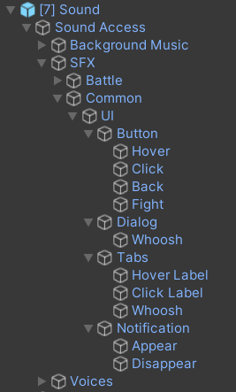
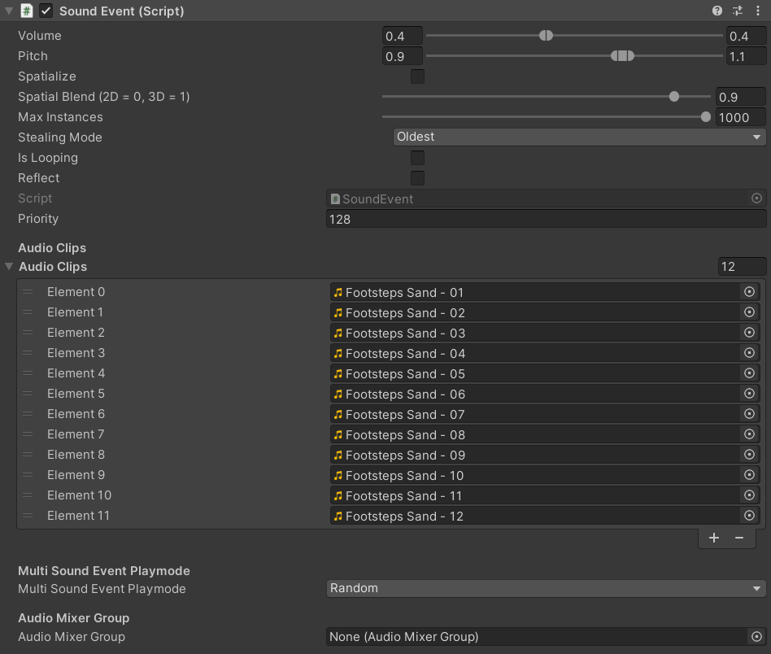

# Simple Audio Solution

**Simple Audio Solution** is a audio middleware for Unity to keep your audio nice and clean. It is an open-source alternative to proprietary tools like [FMOD](https://www.fmod.com/) and [Wwise](https://www.audiokinetic.com/en/products/wwise) and is completely free to use.


## Core Features

Here are the reasons why we like working with the **Simple Audio Solution**.

### Sound hierarchy

The complete sound configuration is placed in one prefab. Each sound event has an ID, e.g. `/SFX/Common/UI/Dialog/Fade In`, which is its path in the prefab. 



Why does this help?

1. When your sound designer wants to add sounds to the project in Unity he doesn't have to look through complicated UI or other hierarchies to find the right place. He just needs to know where to find the prefab. Everything else can be safely ignored by him.

2. As a programmer you can easily add a placeholder sound and tell your sound desginer to replace e.g. sound `/SFX/Common/UI/Dialog/Whoosh` in the next step.

3. When working with version control systems like Git, you want to have prefabs to prevent merge conflicts in the scene. Your sound designer can make changes to the prefab without modifying a scene, allowing you as a programmer to keep working with the scene without conflicts.

### Simple API / Editor

Obviously, the **Simple Audio Solution** can and does not have the features of [FMOD](https://www.fmod.com/) and [Wwise](https://www.audiokinetic.com/en/products/wwise). It tries to focus on the problems that everyone has when not relying on a proprietary solution. For those problems it provides a simple API / Editor.

#### Select a random clip

For example, you want to randomize footsteps. Just drag more than one `AudioClip` in the *Audio Clips* section and the **Simple Audio Solution** will select one randomly. If you want to make sure it is always a different one select *Shuffle* for *Multi Sound Event Playmode*.



#### Play oneshots

Let's say you want to add a button click sound. Simply use the following code:

```csharp
SoundAccess.GetInstance().PlayOneShot2D("/SFX/Common/UI/Button/Click");
```

## Getting Started

### Installation

First install the [Git Dependency Resolver For Unity]("https://github.com/mob-sakai/GitDependencyResolverForUnity") by adding the following lines to your `manifest.json`:


```json
{
  "dependencies": {
    "com.coffee.git-dependency-resolver": "https://github.com/mob-sakai/GitDependencyResolverForUnity.git"
  }
}
```

*Other ways to install the [Git Dependency Resolver For Unity]("https://github.com/mob-sakai/GitDependencyResolverForUnity") can be found on their GitHub page.*

Then install the **Simple Audio Solution** by adding the following lines to your `manifest.json`:

```json
{
  "dependencies": {
    "com.produktivkeller.simple-audio-solution": "https://github.com/PRODUKTIVKELLER/simple-audio-solution.git"
  }
}
```

### Set-Up

1. Copy and paste the example prefab `Packages/com.produktivkeller.simple-audio-solution/Prefabs/SoundAccess` to your `Assets` folder. Otherwise, your changes to the prefab will be overriden when updating the **Simple Audio Solution**!

2. Copy the `AudioMixer` found at `Packages/com.produktivkeller.simple-audio-solution/Audio Mixer/Audio Mixer - Example` to any `Resources` folder in your project and rename it to `Audio Mixer`.

3. Drag and drop the prefab from step one to your scene.

4. That's it!


## Documentation

### Play a sound

There are two ways to play a sound.

1. Use a `SoundEmitter`. It basically works like the Unity `AudioSource`. It has methods for `SoundEmitter.Play()` and `SoundEmitter.Stop()`. The key of the sound can be specified in the Inspector window. The key is a path to a `SoundEvent` in the `SoundAccess` prefab. It always starts with a `/` and can contain any characters Unity allows in the hierarchy, e.g. `/SFX/Temple/Arrow Trap/Shoot`. Right now there is no auto-completion but we plan to add it in a later update.

```csharp
// Use it just like an AudioSource
SoundEmitter soundEmitter = GetComponent<SoundEmitter>();
soundEmitter.Play();
soundEmitter.Stop();

// You can change the key via API. When you call SoundEmitter.Play() the next time, the new event will be played.
soundEmitter.key = "/SFX/Temple/Spike Trap/Snap";
```

2. Use a one-shot by calling any of the following methods. This is convenient when the position of your object does not change, e.g. for 2D sounds like UI sounds or 3D sounds like a bullet impact.

```csharp
SoundAccess.GetInstance().PlayOneShot2D(string key);
SoundAccess.GetInstance().PlayOneShot(string key, Vector3 position);
SoundAccess.GetInstance().PlayOneShot2DDelayed(string key, float delayInSeconds);
```

## References

The **Simple Audio Solution** is used in [Pin Them](https://store.steampowered.com/app/1764220/Pin_Them). It is developed by two German game studios, [PRODUKTIVKELLER Studios](https://produktivkeller.com/) and [Creactstudios](https://creactstudios.com/).

## Contributing

As an open-source project we would love to see you contributing to the project. If you have feature requests or want to contribute, feel free to reach out to us via **GitHub**, join our [Discord](https://discord.gg/KMurg8H823) or write us an email at `info.produktivkeller@gmail.com`.